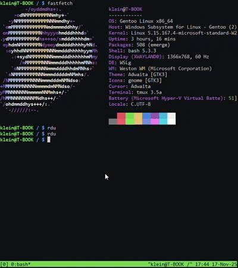

# RDU (Ratatui Disk Usage)

RDU is a terminal-based disk usage analyzer written in Rust, built on top of [Ratatui](https://github.com/ratatui/ratatui). It provides a fast and interactive interface to explore disk usage directly in your terminal, inspired by the popular `ncdu` tool.

## Features

- Interactive terminal UI for browsing directories and disk usage
- Fast scanning of large directories
- Keyboard navigation for easy exploration
- Written entirely in Rust, leveraging the [Ratatui](https://github.com/ratatui/ratatui) library

.png)
---

